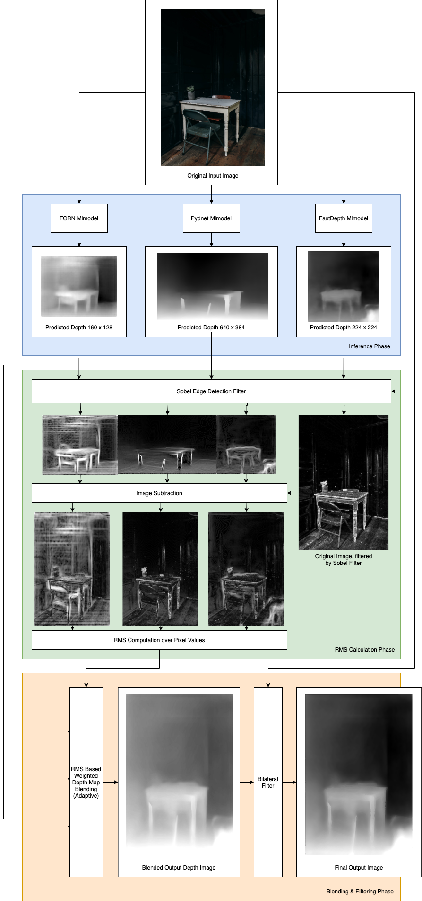

# 3Dify App

`UNDER CONSTRUCTION`

The 3Dify app is an experimental iOS app to create 3D effects on photos. The final result looks something like this:

The effect is achieved by two steps:

1. Create a disparity map for the photo. On devices with multi camera arrays in portrait mode, the disparity map is provided by the `AVCaptureDelegate`. On devices without, the app makes use of CoreML to interpret the depth map using a custom [pipeline](#pipeline).
2. Use a Metal driven view to apply parallax occlusion mapping, using the calculated disparity map as depth.

## Contributing

`UNDER CONSTRUCTION`

- Read our [contributing guide](documentation/contributing.md) to start developing on this project.

## Delivery

`UNDER CONSTRUCTION`

- Read our [delivery guide](documentation/delivery.md) to know how this project is delivered.

## Pipeline

On devices without the capability to create disparity maps (e.g. iPhone SE First Gen), the app makes use of a custom CoreML driven pipeline to create a disparity image. The pipeline looks like this:

The pipeline takes the original image as input and creates three different depth estimations using the FCRN mlmodel, the FastDepth mlmodel and the Pydnet mlmodel. To evaluate which estimated depth map is of the best quality (for blending), the pipeline computes a specific rms error value for each depth map. This is done by applying a sobel image to both the depth map as well as the original image. Then, by measuring the distance between the sobel images, a RMS value can be computed. Based on the RMS value, the pipeline blends the depth maps together. To further smoothen the surfaces of the combined depth map while preserving edges, the pipeline applies a bilateral filter which takes the edge details from the original image and smoothes the combined depth map.

## Related Work

This project makes use of models and work by other authors:
- CoreMLHelpers by Matthijs Hollemans for post-inference MLMultiArray processing: https://github.com/hollance/CoreMLHelpers
- The CoreML model of FastDepth by JustinFincher: https://github.com/JustinFincher/FastDepth-CoreML
- The CoreML model of FCRN by Apple: https://developer.apple.com/machine-learning/models/
- The CoreML model of Pydnet by Filippo Aleotti: https://github.com/FilippoAleotti/mobilePydnet

## Licenses

Please see the provided [LICENSES.MD](LICENSES.MD) for the licenses to thirs party software. These licenses only apply to third party software and not to this project. If you want to use my code, please contact me first. You can see which code is copyrighted to me by having a look to each file's header.

